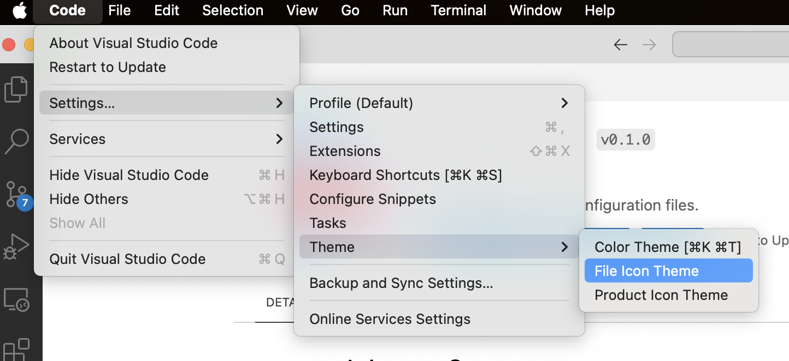

# rainbow-s2

Editors for [@rainbow/d9](https://github.com/InsureMO/rainbow-d9) and [@rainbow/o23](https://github.com/InsureMO/rainbow-o23)

## Features

The editors for [@rainbow-d9](https://github.com/InsureMO/rainbow-d9) and [@rainbow-o23](https://github.com/InsureMO/rainbow-o23),

- D9 Editor
  
- O23 Editor
  
  

Also provided the file icons, which need to be activated manually,

- Activate by extension page:
  
- Activate by menu:
  
- Activate by command palette:
  

> @Rainbow file icons theme is based on Seti.

### Extension Settings

Each file can be extended by a `.mjs`, referring to the example in [/src/test](https://github.com/InsureMO/rainbow-s2/tree/main/src/test).
The `.mjs` file must follow these rules:

- It can only use `export default`; other `export` methods, such as `export const x = 1;`, are not allowed.
- `export default` must be at the end of the file, and no other content is permitted after it.

Finding extension files is performed according to the following rules:

- For `d9`: Look for a file with the same name in the same directory, but with the `.mjs` suffix. For example, if the file being edited is
  `test.d9`, the extension file would be `test.d9.mjs`. If the file being edited is `test.md`, then the extension file would be
  `test.md.mjs`.
- For `o23`:
	- Look for a file with the same name in the same directory, but with the `.mjs` suffix. For example, if the file being edited is
	  `test.o23`, the extension file would be `test.o23.mjs`. If the file being edited is `test.yaml`, then the extension file would be
	  `test.yaml.mjs`.
	- If the extension file does not exist in the same directory, then look for the closest `.o23.mjs` file in the same directory as the
	  nearest `package.json` file.

## Known Issues

- The editor does not respond immediately to changes in the corresponding `.mjs` document; you must reopen it to apply the latest extension
  settings. This situation occurs in scenarios where the editor remains continuously visible, such as in split views.
- The editor loses its operational state when reactivated.

[//]: # (## Release Notes)

[//]: # (Users appreciate release notes as you update your extension.)

[//]: # (### 1.0.0)

[//]: # ()

[//]: # (Initial release of ...)

[//]: # ()

[//]: # (### 1.0.1)

[//]: # ()

[//]: # (Fixed issue #.)

[//]: # ()

[//]: # (### 1.1.0)

[//]: # ()

[//]: # (Added features X, Y, and Z.)

